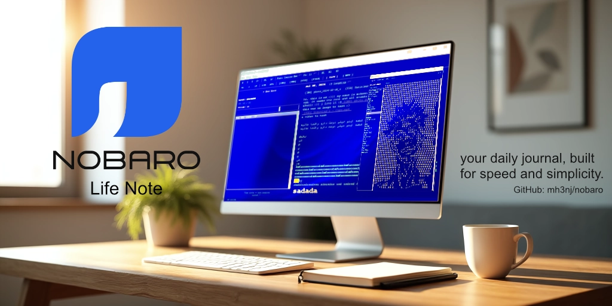
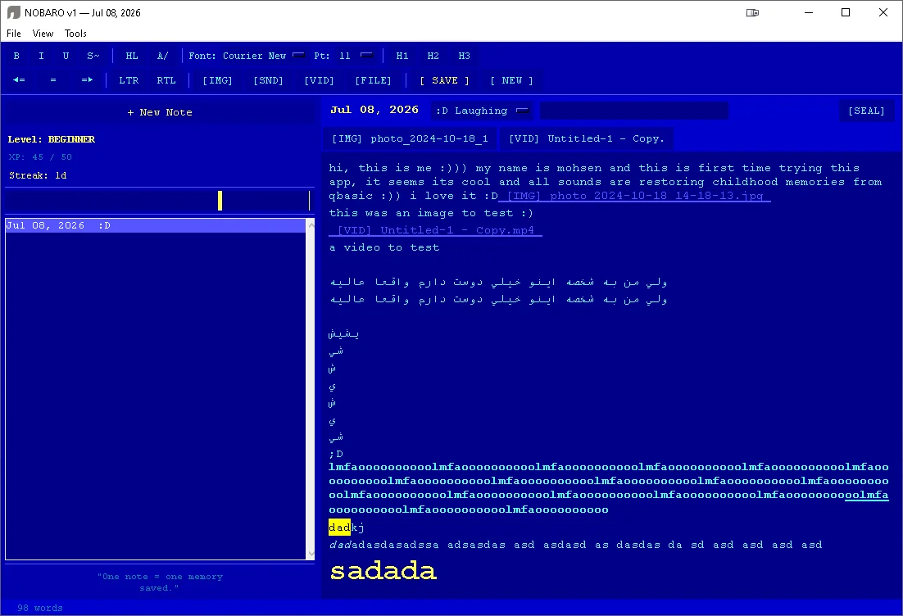
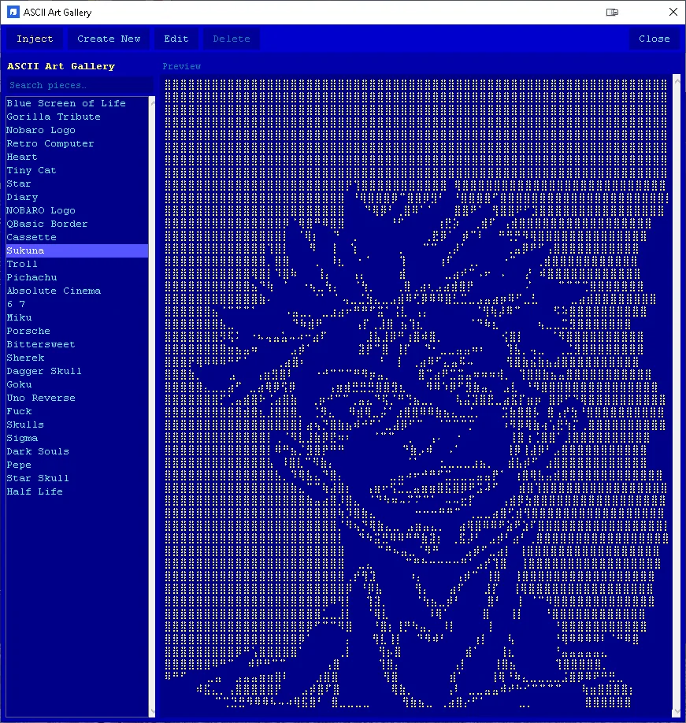
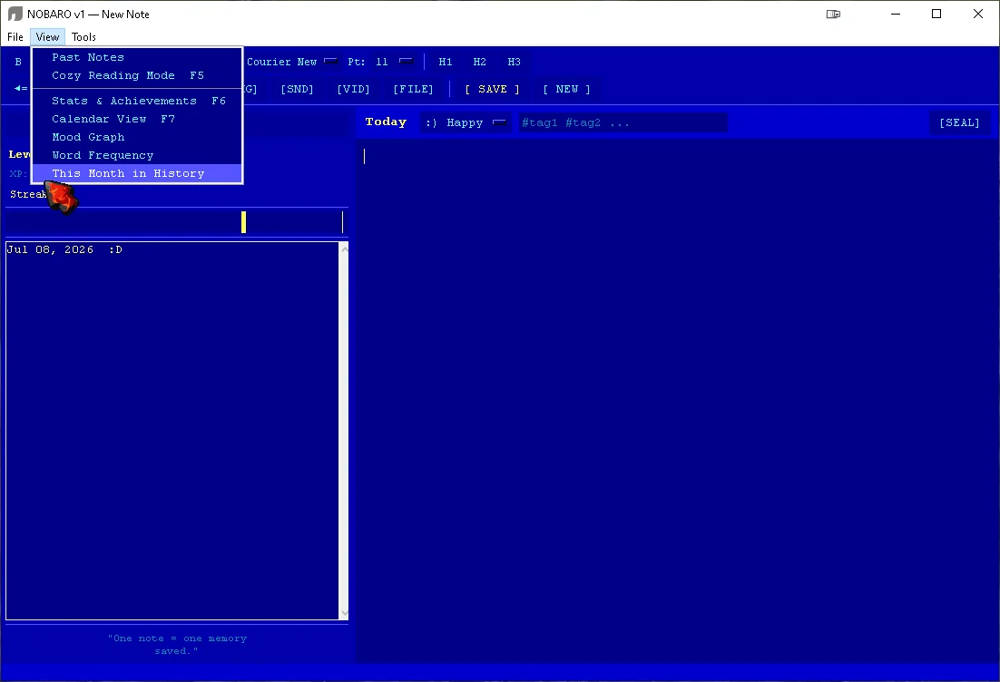
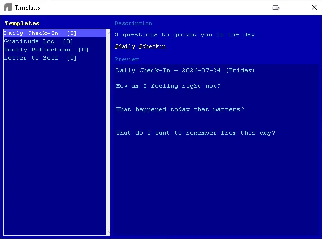
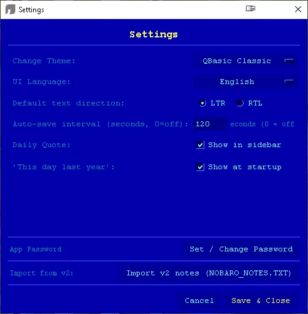
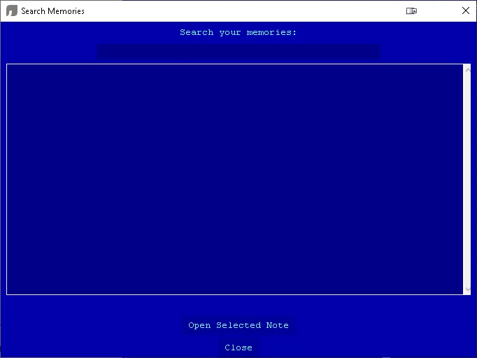
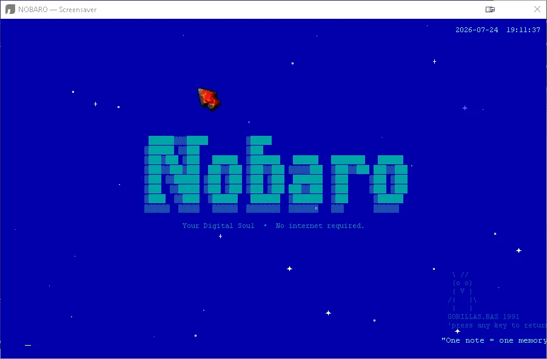
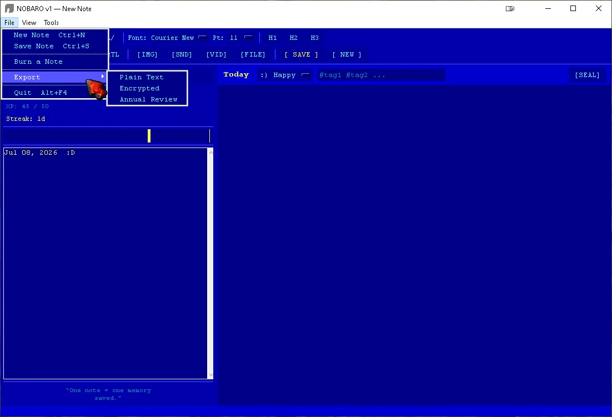

<p align="center">
  
</p>

<h1 align="center">NOBARO</h1>

<p align="center">
  <em>Your Digital Soul — a peaceful, offline note engine.</em>
</p>

<p align="center">
  <a href="LICENSE"></a>
  <a href="https://www.python.org/"></a>
  <a href="https://github.com/mh3nj/nobaro-mobile"></a>
  <a href="https://img.shields.io/badge/Platform-Windows%20%7C%20Linux%20%7C%20macOS-lightgrey"></a>
  <a href="CONTRIBUTING.md"></a>
  <a href="https://github.com/mh3nj/nobaro/stargazers"></a>
</p>

---

> ## A note from the author
>
> **NOBARO was inspired by [github.com/mh3nj/lifenote](https://github.com/mh3nj/lifenote)** — it was written from **PureBasic to pure Python** with the same style and everything, and now it's advanced and **live at [github.com/mh3nj/nobaro](https://github.com/mh3nj/nobaro)**.
>
> This project's **mobile Flutter version** lives at **[github.com/mh3nj/nobaro-mobile](https://github.com/mh3nj/nobaro-mobile)** — and while you're there, check out **nobaro-mobile as a professional GitHub repo template** :))
>
> **This is a full rebrand and a full redesign.** Same soul, brand-new body.

---

## 📑 Table of Contents

- [Table of Contents](#-table-of-contents)
- [What is NOBARO?](#-what-is-nobaro)
- [Features](#-features)
- [Screenshots](#-screenshots)
- [Video Demo](#-video-demo)
- [Quick Start](#-quick-start)
  - [Option 1 — Windows executable (recommended)](#option-1--windows-executable-recommended)
  - [Option 2 — From source](#option-2--from-source)
- [Keyboard Shortcuts](#-keyboard-shortcuts)
- [ASCII Art Gallery](#-ascii-art-gallery)
- [Privacy \& Data](#-privacy--data)
- [Architecture](architecture)
- [Building from Source](building-from-source)
  - [Desktop executable (Windows)](#desktop-executable-windows)
  - [Running tests / checks](#running-tests--checks)
- [Project History](#-project-history)
- [Mobile Companion](#-mobile-companion)
- [Roadmap](roadmap)
- [Contributing](#-contributing)
- [Credits](#-credits)
- [License](#-license)

---

## What is NOBARO?

NOBARO is a note engine for people who want their thoughts to live **on their own machine**. No cloud. No accounts. No ads. No algorithm telling you what to write.

It's a **pure-Python tkinter desktop app** (no runtime dependencies — just the standard library) with a **Flutter mobile companion**. You write notes, tag them with moods, and the app quietly keeps track of streaks, XP, and the patterns of your life over time.

> Why "NOBARO"? It sounds like **"no bar"** — no barriers, no subscriptions, no nonsense. The tagline *"Your Digital Soul"* is a joke we're only half-serious about.

---

## Features

**Writing**
- **Unlimited notes per day** — a day is no longer capped at one entry; write as many as a day actually needs
- **Rich text editor** — bold, italic, underline, strikethrough, highlight, headings, fonts, colors, alignment, RTL support
- **Mood tracking** — tag every note with a mood (`:D` `:)` `:|` `:(` `;(`) and see a 60-day mood bar
- **ASCII art gallery** — browse built-in art, **search** by name, and **create, edit, delete and inject your own** with one click (F8)

**Motivation**
- **XP & levels** — earn XP for writing, attaching media, and formatting; level up through 11 ranks from BEGINNER to TRANSCENDENT
- **Achievements** — unlockable badges for streaks, media, long notes, burning notes, and more
- **Streaks** — daily writing streaks with XP bonuses at 3, 7, 14, 30, 60, 100+ days

**Memory**
- **Sealed letters** — write a letter to your future self and lock it until a chosen date
- **Unsent letters** — write the letters you'll never send
- **"This day last year"** — NOBARO quietly reminds you what you were feeling one year ago
- **Gap detection** — it notices the days you missed and invites you to fill them in

**Tools**
- **Search** — full-text grep across every note
- **Stats & analytics** — overview, mood graphs, calendars, word frequency, monthly views, annual review export
- **Templates** — save and reuse note templates
- **Screensaver** — a QBasic-style animated screensaver (F10)
- **Encryption** — XOR-based encrypted export (`.lne`) with password protection
- **Media attachments** — attach images, audio, video, or any file to a note
- **Backups** — automatic timestamped backups of all your data
- **Themes** — QBasic Classic, Green Phosphor, Amber Phosphor, Midnight, Paper
- **Cozy reading mode** — distraction-free full-screen reader (F5)
- **Bilingual UI** — English and فارسی (Farsi) with RTL support
- **Autosave** — configurable interval-based saving

---

## Screenshots

<table>
  <tr>
    <td align="center"><br/><sub>Main window</sub></td>
    <td align="center"><br/><sub>ASCII art gallery</sub></td>
  </tr>
  <tr>
    <td align="center"><br/><sub>Stats & calendar views</sub></td>
    <td align="center"><br/><sub>Templates</sub></td>
  </tr>
  <tr>
    <td align="center"><br/><sub>Settings</sub></td>
    <td align="center"><br/><sub>Search memories</sub></td>
  </tr>
  <tr>
    <td align="center"><br/><sub>Screensaver</sub></td>
    <td align="center"><br/><sub>Files & attachments</sub></td>
  </tr>
</table>

---

## Video Demo

<p align="center">
  <a href="https://www.youtube.com/watch?v=YOUR_VIDEO_ID">
    
  </a>
  <br/>
  <sub>Click the thumbnail to watch the demo — link is updated on each release.</sub>
</p>

[demo.webm](https://github.com/user-attachments/assets/da51ab99-a2a2-429f-bb80-ef8dfe7fe9a7)


---

## Quick Start

### Option 1 — Windows executable (recommended)

Download the latest `NOBARO_vX.Y.Z_windows_x64.zip` from the **[Releases](https://github.com/mh3nj/nobaro/releases)** page, unzip it, and run `nobaro.exe`. No Python required. Fully portable — all your data is saved next to the executable.

### Option 2 — From source

```bash
# Requires Python 3.9+ with tkinter (ships with Python on Windows/macOS)
# On Debian/Ubuntu:  sudo apt install python3-tk

git clone https://github.com/mh3nj/nobaro.git
cd nobaro

# Optional: create a virtual environment
python -m venv .venv
source .venv/bin/activate        # Windows: .venv\Scripts\activate

# NOBARO has ZERO runtime dependencies — it runs on the standard library alone.
# (Optional, for sound effects on non-Windows:)
pip install -r requirements.txt

python main.py
```

That's it. Your notes live in `data/notes/` as plain JSON — easy to read, easy to back up, easy to keep forever.

---

## Keyboard Shortcuts

| Key | Action |
|-----|--------|
| `Ctrl+N` | New note |
| `Ctrl+S` | Save note |
| `Ctrl+F` | Search memories |
| `Ctrl+B` / `Ctrl+I` / `Ctrl+U` | Bold / Italic / Underline |
| `F5` | Cozy reading mode |
| `F6` | Stats & achievements |
| `F7` | Calendar view |
| `F8` | **ASCII art gallery** |
| `F9` | Templates |
| `F10` | Screensaver |
| `F12` | Settings |

---

## ASCII Art Gallery

Press **F8** (or the `[ART]` toolbar button) to open the gallery.

- **Browse** — click any piece to preview it
- **Search** — a live search box filters your whole collection by name as you type
- **Inject** — click *Inject* (or double-click) to drop the art straight into your note editor on its own new line
- **Create** — make your own ASCII art from scratch
- **Edit** — tweak any of your own pieces in a live editor
- **Delete** — remove the pieces you no longer need (built-ins are protected)

Your creations are saved as plain `.txt` files in `data/ascii/` — share them, back them up, or drop new files in the folder to add them to your gallery.

---

## Privacy & Data

NOBARO is **offline-first by design**:

- No internet connection, ever (the only exception: opening a media attachment with your system default app)
- No accounts, no telemetry, no tracking
- All data is plain JSON on *your* disk: `data/notes/`, `data/player.json`, `data/ascii/`
- Automatic timestamped backups in `data/backup/`
- Optional password + XOR encryption for exported archives (`.lne`)

**You own your words. Always.**

---

## Architecture

```
nobaro/
├── main.py              # Entry point — tkinter App class (UI shell)
├── main.spec            # PyInstaller build spec
├── core/                # Pure-Python logic (no GUI — fully testable)
│   ├── constants.py     # Paths, themes, levels, moods, quotes
│   ├── utils.py         # Dates, streaks, gaps, crypto, JSON I/O
│   ├── data.py          # Note / Player / Achievement / Letter / Template models + stores
│   └── player_logic.py  # XP, level-up and achievement logic
├── ui/
│   └── theme.py         # Theme singleton (QBasic Classic, Phosphor, Amber, …)
├── features/
│   ├── about.py         # About dialog with logo & credits
│   ├── ascii_art.py     # ASCII art gallery (browse / inject / create / edit / delete)
│   ├── export.py        # Plain-text, encrypted and annual-review exports + v2 import
│   ├── screensaver.py   # QBasic-style animated screensaver
│   ├── settings.py      # Preferences dialog
│   ├── stats.py         # Overview, calendar, mood graph, word frequency
│   └── templates.py     # Template browser & creator
├── assets/
│   ├── lang.py          # English + Farsi strings
│   └── sounds.py        # QBasic-style beep melodies (winsound, silent fallback)
├── public/              # Branding — logo.png
├── docs/                # Banner, screenshots
├── tools/               # Icon generation scripts
└── data/                # Runtime data (notes, media, backups) — gitignored
```

**Design principle:** *core/* is pure Python with zero GUI imports, so the entire engine is unit-testable headlessly. The GUI lives in *features/* and *main.py* only.

---

## Building from Source

### Desktop executable (Windows)

```bash
pip install pyinstaller pillow
python tools/make_icon.py        # regenerates icon.ico from public/logo.png
pyinstaller main.spec            # → dist/nobaro/nobaro.exe
```

The spec bundles the branded logo, sets the exe icon, and produces a **windowed** (no console) build whose data folder sits next to the executable.

### Running tests / checks

```bash
python -m compileall main.py core ui features assets   # syntax check
```

---

## Project History

NOBARO started as **LifeNote**, a note-taking app written in **PureBasic** back in 2022. LifeNote was functional but brittle — PureBasic is great for small Windows tools, but it couldn't grow.

So NOBARO was **rewritten from scratch, from PureBasic to pure Python** — keeping the same style and everything, but with a modern architecture:

- ✅ Modular, testable codebase (`core/` logic separated from the GUI)
- ✅ Cross-platform: Windows, Linux, macOS
- ✅ Unlimited notes per day (LifeNote capped you at one)
- ✅ Rich text, media attachments, themes, achievements, sealed letters
- ✅ A Flutter mobile companion that never existed before

**This is a full rebrand and a full redesign** — inspired by, and standing on the shoulders of, the original LifeNote at [github.com/mh3nj/lifenote](https://github.com/mh3nj/lifenote).

If you used LifeNote before, welcome back — use **Tools → Settings → Import v2 notes** to bring your old `NOBARO_NOTES.TXT` memories with you.

---

## Mobile Companion

Take your soul with you. The Flutter version of NOBARO — built with the same data model and the same vibe — lives at:

**[github.com/mh3nj/nobaro-mobile](https://github.com/mh3nj/nobaro-mobile)**

It reads the same `data/` directory, so your notes stay in sync wherever you write them. While you're there, note that **nobaro-mobile is also our professional GitHub repo template** — the exact structure, docs and workflows NOBARO follows :))

---

## Roadmap

- [ ] Full sync protocol between desktop and mobile (LAN or USB)
- [ ] Tag-based filtering in the sidebar
- [ ] Markdown export/import
- [ ] Plugin system for custom export formats
- [ ] More themes (community submissions welcome!)
- [ ] End-to-end encryption for data at rest
- [ ] Better mobile experience — push notifications for streaks

No deadlines. This is a passion project.

---

## Contributing

Contributions are welcome and appreciated — see **[CONTRIBUTING.md](CONTRIBUTING.md)** for the full guide (code style, workflow, and review process).

The short version:

1. Open an issue first if you're planning something big — let's talk design before code
2. Fork, branch, code, test, PR
3. Match the existing style. Be kind. Keep it simple.

---

## Credits

- **Developed by** — [github.com/mh3nj](https://github.com/mh3nj) · [mh3n.com](https://mh3n.com)
- **Logo designed by** — [parsegan.com](https://parsegan.com)
- **Sponsored by** — [dahgan.com](https://dahgan.com)

---

## License

MIT. See [LICENSE](LICENSE).

You can use, modify, and distribute this software freely. Attribution is appreciated but not required.

---

<p align="center">
  <code>10 PRINT "you matter"</code><br/>
  <code>20 GOTO 10</code>
</p>
